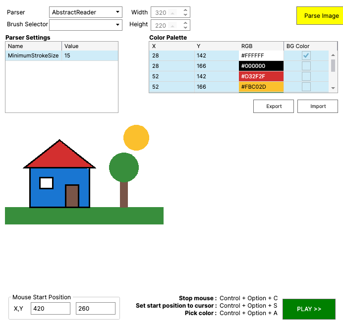

# DrawThatThing

DrawThatThing turns an image into mouse strokes and plays them back, so it can draw the image
in any paint program or browser drawing game.



It runs on Windows, macOS and Linux (X11). Building it needs the [.NET 9 SDK](https://dotnet.microsoft.com/download/dotnet/9.0).

## Running

On macOS, build and open the app bundle:

```bash
./build-macos-app.sh
open publish/DrawThatThing.app
```

On Windows and Linux:

```bash
dotnet run --project DrawThatThing.Avalonia
```

To get a standalone copy that runs without .NET installed, use
`dotnet publish DrawThatThing.Avalonia -c Release -r <runtime> --self-contained`, where `<runtime>`
is for example `win-x64`, `osx-arm64` or `linux-x64`.

### macOS permissions

The app needs two permissions under System Settings → Privacy & Security:

- **Accessibility**, to move and click the mouse. The app asks for it when it starts.
- **Screen Recording** (called Screen & System Audio Recording on macOS 15 and later), to pick
  colors from the screen. The app asks for it the first time you pick a color.

Restart the app after granting them. macOS ties the permissions to the exact build, so after
rebuilding you have to grant them again.

### Linux

DrawThatThing needs X11 with the XTest extension (`libx11-6` and `libxtst6` on Debian and Ubuntu).
Wayland is not supported.

## Drawing an image

1. Open the program you want to draw in.
2. Hover over each color in that program's palette and press the *pick color* hotkey. DrawThatThing
   stores the color and its position on the screen, and clicks there whenever it needs that color.
   Tick **BG Color** for the background color.
3. Choose a parser, click **Parse Image** (or drop an image onto the window) and check the preview.
4. Hover where the top-left corner of the drawing should go and press the *set start position*
   hotkey. Then click **PLAY >>**. The *stop* hotkey stops the drawing.

Palettes can be saved and loaded as CSV files with **Export** and **Import**.

## Hotkeys

| Windows and Linux | macOS 15 and later | Action |
|-------------------|--------------------|--------|
| Shift+Alt+C | Control+Option+C | Stop drawing |
| Shift+Alt+S | Control+Option+S | Set the start position to the cursor |
| Shift+Alt+A | Control+Option+A | Add the color under the cursor to the palette |
| Shift+Alt+D | Control+Option+D | Show or hide the debug panel |
| Shift+Alt+Q | Control+Option+Q | Add the cursor position as a debug point |

Older macOS versions use Shift+Option. The hotkeys work while another program is in front. A
hotkey shown in red could not be registered, usually because another program already uses it.

## Parsers

- **AbstractReader** fills areas of the same color with strokes. It needs a background color.
- **DetailedReader** joins neighboring pixels of the same color into strokes and skips white.
- **LinearReader** draws every dark pixel with the black palette color.
- **PointReader** clicks every pixel separately.

More parsers can be added as DLLs with an `IBitmapReader` implementation, put into a `Plugins`
folder next to the executable. In the macOS bundle that folder is
`DrawThatThing.app/Contents/MacOS/Plugins`; sign the bundle again afterwards with
`codesign --force --deep --sign - DrawThatThing.app`.

## Development

```bash
dotnet build DrawThatThing.sln
dotnet test DrawThatThing.Tests
```

The project page is at https://egeozcan.github.io/DrawThatThing/.

## License

GPL-3.0, see [LICENSE.txt](LICENSE.txt).
